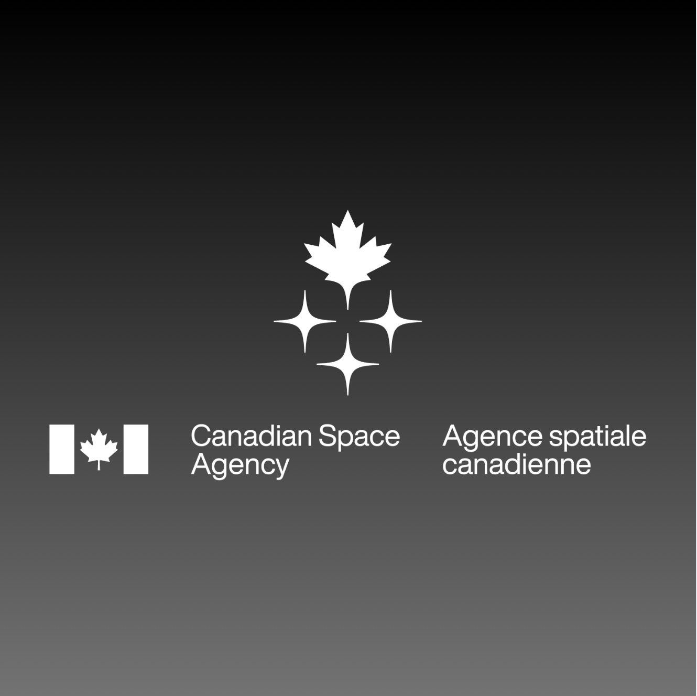
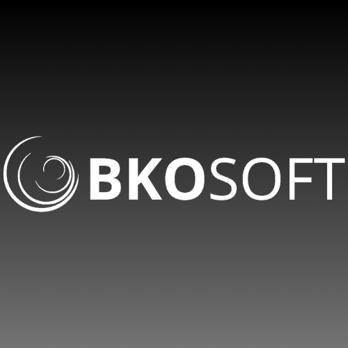
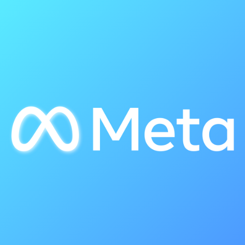
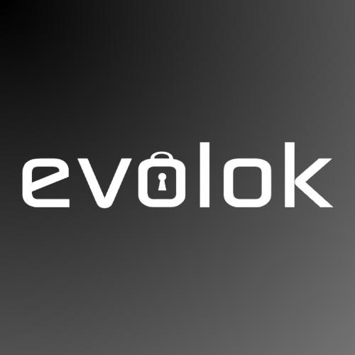
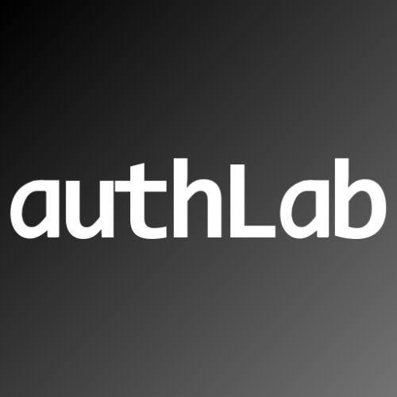
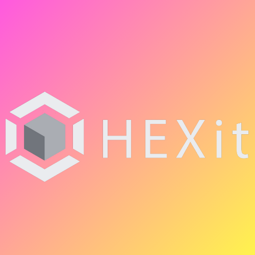

  

  

  
  
  

## 🧭 About me

I'm a data scientist at the **Canadian Space Agency** and a **Project Manager Lead** at the Centre for Analytics, Informatics and Research (CAIR) at Memorial University of Newfoundland, where I'm also a **PhD researcher**. My work sits at the intersection of data science, computer vision and high-performance computing: turning large research datasets into reliable, reproducible tools.

Before this, I was a technical investigator at Meta and a software engineer across the UK, Switzerland and North America.

### 🎯 Current focus
- 🌊 Segmentation of remotely sensed (RPAS/drone) imagery for habitat mapping
- 🚀 ML pipelines on HPC clusters, including GPU inference at scale
- 📚 Research software engineering and coding standards for research teams

## 🛠️ Skills

**🤖 Machine Learning & Data Science** 

**🛰️ Computer Vision & Visualization** 

**⚙️ Infrastructure & HPC** 

**💻 Software Engineering & Data** 

**🛡️ Testing & Security** 

## 💼 Experience

| | Organization | Role | Location | Technologies |
|---|---|---|---|---|
|  | [CAIR, Memorial University](https://www.mun.ca/research/cair/who-we-are/)  | Project Manager Lead | St. John's, NL, CA | Python, Bash, SQL, ML, algorithm design, quantum computing, HPC, research data analysis |
|  | [Memorial University of Newfoundland](https://www.mun.ca)  | PhD Researcher | St. John's, NL, CA | Python, Bash, SQL, ML, algorithm design |
|  | [Canadian Space Agency](https://www.asc-csa.gc.ca)  | Data Scientist (Researcher) | Ottawa, ON, CA | Python, Bash, SQL |
|  | [University of Essex](https://www.essex.ac.uk/) | Software Developer (Data Integration) | Colchester, UK | C#, .NET, Bash, SQL, Windows Server |
|  | [BkoSoft](https://www.bkosoft.ch/) | Software Engineer | Zurich, CH | C#, .NET, SQL, Razor |
|  | [Meta](https://www.meta.com/) | Technical Investigator | London, UK | SQL, JavaScript, Haskell, Hack, Unidash |
|  | [Evolok Ltd](https://www.evolok.com/) | Java Developer | London, UK | Java, Spring Boot, SQL, MongoDB |
|  | [AuthLab Ltd](https://authlab.io/) | Data Scientist | Sylhet, BD | Python, SQL, NoSQL, JavaScript, AWS, Bash |
|  | [HEXit Ltd](https://hexit.com.bd) | Data Analyst | California, US | Python, SQL, JavaScript, AWS, Google Cloud |
|  | [Apple](https://apple.com) | Product Design Engineering Intern | Shanghai, CN | Data modelling, Python |
|  | [Mozilla](https://mozilla.org) | Rust Engineer | California, US | Rust, JavaScript, Python |
|  | [Google](https://google.com) | Software Engineer Intern | San Francisco, US | Data science, data visualization, Google Cloud |

## 📫 Get in touch

I'm open to research collaborations and applied ML, computer vision or research computing. Reach me through [my website](https://www.soft.me.uk) or [LinkedIn](https://www.linkedin.com/in/sof/).

  

