<p align="center">
  
</p>

<p align="center">
  <a href="https://www.soft.me.uk"></a>
  <a href="https://www.linkedin.com/in/sof/"></a>
  
</p>

## `$ cat about.md`

I'm a data scientist at the **Canadian Space Agency** and a **Project Manager Lead** at the Centre for Analytics, Informatics and Research (CAIR) at Memorial University of Newfoundland, where I'm also a **PhD researcher**. My work sits at the intersection of data science, computer vision and high-performance computing: turning large research datasets into reliable, reproducible tools.

Before this, I was a technical investigator at Meta and a software engineer across the UK, Switzerland and North America.

## `$ cat focus.yaml`

```yaml
current_focus:
  - Segmentation of remotely sensed (RPAS/drone) imagery for habitat mapping
  - ML pipelines on HPC clusters, including GPU inference at scale
  - Research software engineering and coding standards for research teams
```

## `$ ls ~/skills`

`./ml_data_science/`<br/>


`./computer_vision_viz/`<br/>


`./infrastructure_hpc/`<br/>


`./software_engineering/`<br/>


`./testing_security/`<br/>


## `$ git log --career`


**[CAIR, Memorial University](https://www.mun.ca/research/cair/who-we-are/)** &nbsp;`● current`
```yaml
role:  Project Manager Lead
where: St. John's, NL, CA
stack: Python · Bash · SQL · ML · algorithm design · quantum computing · HPC · research data analysis
```
<br clear="left"/>


**[Memorial University of Newfoundland](https://www.mun.ca)** &nbsp;`● current`
```yaml
role:  PhD Researcher
where: St. John's, NL, CA
stack: Python · Bash · SQL · ML · algorithm design
```
<br clear="left"/>


**[Canadian Space Agency](https://www.asc-csa.gc.ca)** &nbsp;`● current`
```yaml
role:  Data Scientist (Researcher)
where: Ottawa, ON, CA
stack: Python · Bash · SQL
```
<br clear="left"/>


**[University of Essex](https://www.essex.ac.uk/)**
```yaml
role:  Software Developer (Data Integration)
where: Colchester, UK
stack: C# · .NET · Bash · SQL · Windows Server
```
<br clear="left"/>


**[BkoSoft](https://www.bkosoft.ch/)**
```yaml
role:  Software Engineer
where: Zurich, CH
stack: C# · .NET · SQL · Razor
```
<br clear="left"/>


**[Meta](https://www.meta.com/)**
```yaml
role:  Technical Investigator
where: London, UK
stack: SQL · JavaScript · Haskell · Hack · Unidash
```
<br clear="left"/>


**[Evolok Ltd](https://www.evolok.com/)**
```yaml
role:  Java Developer
where: London, UK
stack: Java · Spring Boot · SQL · MongoDB
```
<br clear="left"/>


**[AuthLab Ltd](https://authlab.io/)**
```yaml
role:  Data Scientist
where: Sylhet, BD
stack: Python · SQL · NoSQL · JavaScript · AWS · Bash
```
<br clear="left"/>


**[HEXit Ltd](https://hexit.ca)**
```yaml
role:  Data Analyst
where: California, US
stack: Python · SQL · JavaScript · AWS · Google Cloud
```
<br clear="left"/>


**[Apple](https://apple.com)**
```yaml
role:  Product Design Engineering Intern
where: Shanghai, CN
stack: Data modelling · Python
```
<br clear="left"/>


**[Mozilla](https://mozilla.org)**
```yaml
role:  Rust Engineer
where: California, US
stack: Rust · JavaScript · Python
```
<br clear="left"/>


**[Google](https://google.com)**
```yaml
role:  Software Engineer Intern
where: San Francisco, US
stack: Data science · data visualization · Google Cloud
```
<br clear="left"/>

## `$ ./contact.sh`

```console
$ ./contact.sh
Open to research collaborations in applied ML, computer vision and research computing.
  web       https://www.soft.me.uk
  linkedin  https://www.linkedin.com/in/sof/
```
